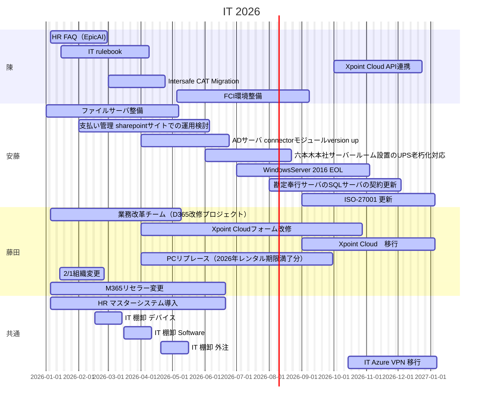

```mermaid
gantt
    title IT 2026
    dateFormat  YYYY-MM-DD
    excludes    weekends
          section 陳
          HR FAQ（EpicAI) : active, 2026-01-05, 40d
          IT rulebook: active, 2026-01-15, 60d
          Xpoint Cloud API連携: active, 2026-10-01, 60d
          Intersafe CAT Migration: active, 2026-03-01, 40d
          FCI環境整備:active, 2026-05-05, 90d          

          section 安藤
          ファイルサーバ整備:active, 2026-01-01, 90d
          支払い管理 sharepointサイトでの運用検討:active, 2026-02-01, 90d               
          ADサーバ connectorモジュールversion up:active, 2026-04-01, 60d                
          六本木本社サーバールーム設置のUPS老朽化対応:active, 2026-06-01, 60d
          WindowsServer 2016 EOL:active, 2026-07-01, 90d
          勘定奉行サーバのSQLサーバの契約更新:active, 2026-08-01, 90d
          ISO-27001 更新:active, 2026-09-01, 90d                                        

          section 藤田
          業務改革チーム（D365改修プロジェクト）: active, 2026-01-05, 90d          
          Xpoint Cloudフォーム改修 : active, 2026-04-01, 150d
          Xpoint Cloud　移行 : active, 2026-09-01, 90d                    
          PCリプレース（2026年レンタル期限満了分）:active, 2026-04-01, 130d
          2/1組織変更 :active, 2026-01-14, 30d
          M365リセラー変更　: active, 2026-01-05, 120d                   
         
         section 共通
        　HR マスターシステム導入:active, 2026-01-05, 120d
          IT 棚卸 デバイス: active, 2026-02-16, 20d
          IT 棚卸 Software: active, 2026-03-16, 20d
          IT 棚卸 外注: active, 2026-04-20, 20d
          IT Azure VPN 移行: active, 2026-10-15, 60d       
```